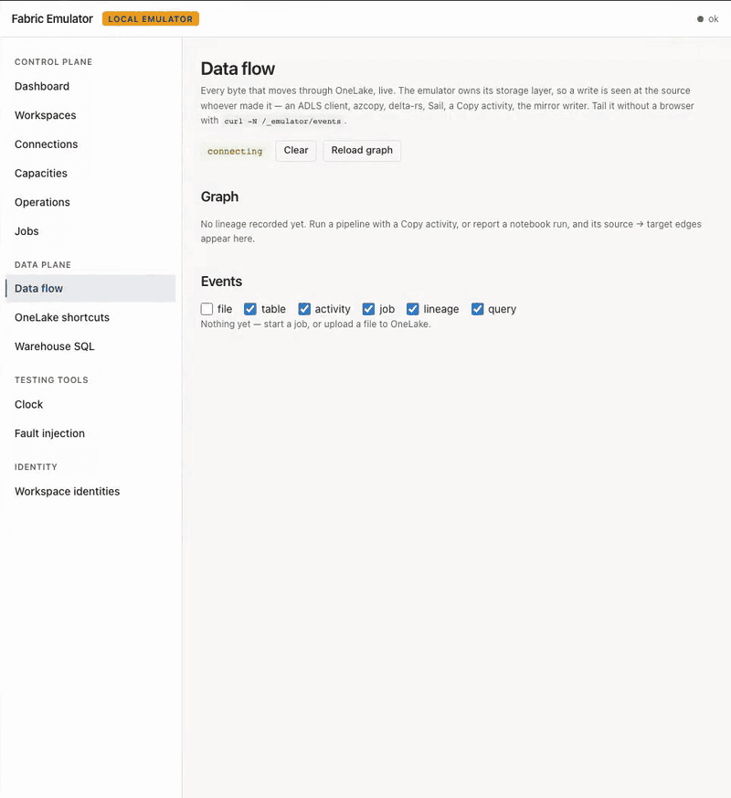
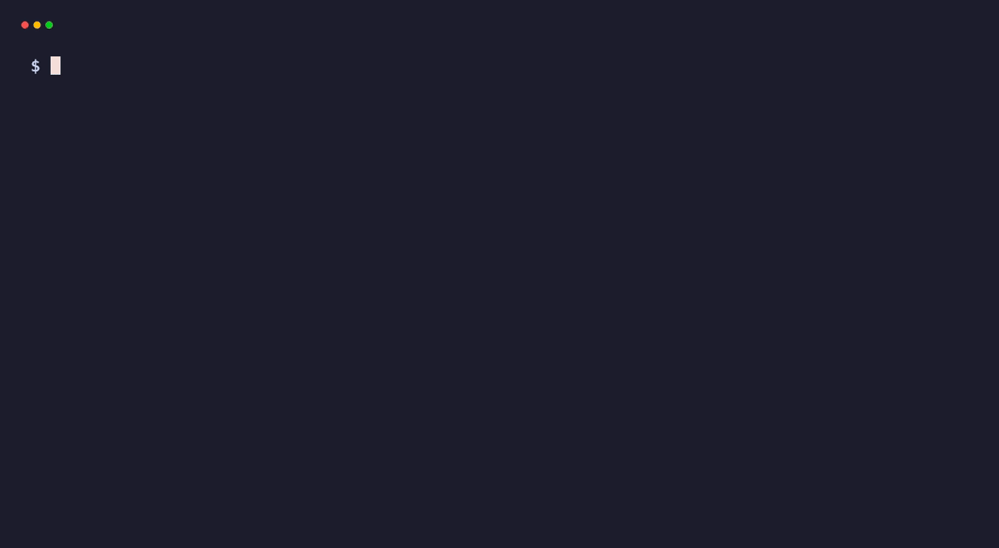

# fabric-emulator

[](https://github.com/calvinchengx/fabric-emulator/releases/latest)
[](https://github.com/calvinchengx/fabric-emulator/actions/workflows/ci.yml)
[](https://calvinchengx.github.io/fabric-emulator/)
[](https://github.com/calvinchengx/fabric-emulator/actions/workflows/codeql.yml)
[](LICENSE)

[](https://calvinchengx.github.io/fabric-emulator/10-testing/)
[](https://calvinchengx.github.io/fabric-emulator/10-testing/)
[](https://calvinchengx.github.io/fabric-emulator/10-testing/)
[](https://calvinchengx.github.io/fabric-emulator/parity/)
[](https://calvinchengx.github.io/fabric-emulator/12-e2e-matrix/)

> Coverage measures the **unit** suites. What catches consumer-facing defects is
> the e2e fleet, which no percentage scores — hence *parity claims witnessed*
> beside it: every claim of support names a test that exists and ran.

A clean-room, local emulator of **Microsoft Fabric**, built to compose with
[entra-emulator](https://github.com/calvinchengx/entra-emulator) — the control
plane (workspaces, items, RBAC, git, LROs, Fabric Core MCP) plus a real
**OneLake** ADLS/Blob data plane, a **T-SQL warehouse** over TDS, native
**Livy** sessions on a real Spark engine, **Data Factory** pipelines (Web,
REST, Salesforce, and Azure Batch Custom on by default), **Apache Airflow**
jobs on a real Airflow scheduler, **KQL** eventhouses, and **Eventstream**
on a real Apache Kafka broker (Lakehouse and Reflex destinations included).



**That is not a mock-up — it is the example below, filmed.** Three source
systems land, get conformed, resolve into one customer identity, and reach a
Warehouse star that Power BI queries: PySpark on a real engine for
bronze → silver, dbt-fabric over real TDS for gold. The run then publishes
itself to **OpenMetadata** — domain, glossary, metrics, contracts and lineage,
all derived from what it already knows rather than typed in twice. Every lineage
edge records **how** it is known, so you can tell what the emulator watched from
what a step merely claimed.

The recording is [regenerated by one script](docs/demo/README.md#regenerate-flowgif)
driving that same example, which asserts its own results — so a recording that
completes is also a passing test, and the hero image cannot quietly drift from
the product. Played at 16×; the run itself takes about five minutes.

Run it yourself:

```bash
make up
cd examples/medallion-advanced-pyspark && uv sync --frozen && uv run python pipeline.py
```

Then open <https://localhost:9443/#flow> for the live flow, and
<http://localhost:8585> for the catalog. Twenty-three steps, about five
minutes, and the run asserts its own results — it is a test, not a demo
script. ([the example](examples/medallion-advanced-pyspark/) ·
[flow observability](docs/31-flow-observability.md) ·
[governance](docs/22-openmetadata.md))

## How it fits together

Real Fabric layers two independent systems: **Entra ID** issues the bearer
tokens, and the **Fabric control plane** (`https://api.fabric.microsoft.com/v1/…`)
serves workspaces, item CRUD, RBAC, git integration and long-running operations.
`entra-emulator` already emulates the first. `fabric-emulator` emulates the
second — and validates every incoming token against entra-emulator's JWKS,
**exactly as real Fabric validates against Entra**.

```
 client / SDK ──Bearer(aud=api.fabric.microsoft.com)──▶ fabric-emulator
                                                          │  validates token
                                                          ▼
                                                     entra-emulator  (JWKS, issuer)
```



## Why

Delivering a data product, source system to landing to medallion to a served
analytics layer, needs three inputs: the source systems' metadata (schema,
semantics), the business goal the stakeholder actually needs answered, and
sample or synthetic data (often derivable from the metadata alone). Proving that
delivery against real Fabric has meant a paid tenant, slow round trips, and
state that is expensive to reset between attempts.

**The same pipeline runs unmodified against `fabric-emulator` and against real
Fabric, one environment variable apart:** see `FABRIC_TARGET` in
[docs/21](docs/21-real-fabric-toggle.md) and the four
[medallion examples](examples/). An AI coding agent, Claude, Codex, Grok, Kimi
K3, whichever you use, iterates offline against the emulator at the speed it
actually works, then proves the result against a real tenant with no code
changes. What used to take a data engineering team months of tenant-bound
trial and error becomes a day, or a week, driven end to end by the agent.

Concretely, that also unlocks:

- **Test Fabric CI/CD with no capacity.** `fabric-cicd`, git integration, and
  deployment pipelines drive item `getDefinition`/`updateDefinition` and
  `git/commitToGit`/`updateFromGit`. Point them at `localhost` instead of a paid
  tenant.
- **Test service-principal automation.** SP → Fabric client-credentials against a
  real (emulated) issuer, deterministic and offline.
- **Deterministic long-running operations.** Every Fabric mutation is async
  (`202` → poll `/v1/operations/{id}`). The emulator's clock control makes an LRO
  complete instantly or pins it in `Running` — impossible against real Fabric.

See [`contoso-data-platform`](https://github.com/calvinchengx/contoso-data-platform)
for what this looks like end to end: four real vendor sources, a full medallion,
a semantic model serving Power BI, all catalogued in OpenMetadata, running
against a published release of this emulator.

## Status

**Working** — the contract spine (P0–P3) *and* the real-compute track (R0–R5)
are shipped and CI-verified on Linux, macOS, and Windows.

- **Contract plane:** workspaces, items, RBAC, deterministic LROs; the CI/CD
  surface (definitions, typed aliases, connections + credential model, git
  integration, jobs — the real `fabric-cicd` tool publishes unmodified); the
  workspace-identity handshake with entra-emulator; and the OneLake ADLS-Gen2 +
  Blob data plane (managed folders, Delta put-if-absent commits, shortcuts).
- **Real compute (attached by default):** real **Spark** over a native Livy agent
  (interactive + high-concurrency sessions, notebook cell execution, Delta via
  ABFS); real **T-SQL over TDS** with Entra **FedAuth** terminated and the
  session byte-spliced to a **SQL Server** sidecar — driven by `go-mssqldb`,
  Microsoft **ODBC Driver 18**, and Microsoft **mssql-python** (the real
  `dbt-fabric` 1.11 adapter passes end-to-end); **DuckDB** SQL over lakehouse Delta; and a pure-Go **pipeline**
  interpreter with real leaf activities. Real clients (delta-rs, the Azure Blob
  SDK, azcopy, PySpark, dbt) drive it in CI as borrowed oracles.
- **Four orchestration surfaces, the ones real Fabric offers.** *Data pipelines*
  — a pure-Go interpreter for Fabric's own activity model, with `Copy` moving
  real bytes, `Lookup` reading real rows, `Script` running real T-SQL, plus the
  control-flow set and per-activity retry/timeout. *Notebook orchestration* —
  `notebookutils.notebook.run` returns the child's **exit value** as Fabric
  documents, and `runMultiple` runs a DAG in dependency order with per-activity
  `retry`, a per-cell timeout, `validateDAG`, and Fabric's failure contract
  (`RunMultipleFailedException` carrying partial results). Fabric's reference-run
  lakehouse rule is enforced, and `concurrency` is honoured when asked for —
  sequential by default, a divergence recorded in [parity.md](docs/parity.md).
  *Schedules* — `.../jobs/{jobType}/schedules` on any item. And *Apache Airflow
  jobs*, below. Pipeline **Web** activities make the real HTTP call (stub only
  if you set `FABRIC_WEB_ACTIVITY=stub`). **Custom** (Azure Batch) runs the
  command on the Spark agent by default (`FABRIC_CUSTOM_ACTIVITY=off` refuses
  it). `RestSource`/`RestSink` and Salesforce Bulk API 2.0 are real too.
- **Real-Time Intelligence (opt-in sidecars):** Eventhouse / KQL Database
  execute on Microsoft's `kustainer` (`--profile rti`). Eventstream items
  provision a Kafka topic; Custom HTTP produce writes real key/value bytes;
  notebooks read with `format("kafka")` + `eventstream.*`. Bind a **Lakehouse**
  destination to append those events as Delta, a **Reflex** destination to
  start a real `EventTriggered` item job
  (`Microsoft.Fabric.Eventstream.EventReceived`), or an **Eventhouse**
  destination to ingest via Kusto `.create-merge` + `.ingest inline`.
  **Operators** (Filter, GroupBy, tumbling Window) run on the produce batch
  before destinations. See [51](docs/51-eventstream-kafka.md).
- **Fabric Core MCP** (`POST /v1/mcp/core`) — Streamable HTTP over the same
  Core REST handlers, witnessed by the unmodified Python `mcp` SDK.
- **Optional full DAX oracle** — empty `FABRIC_DAX_URL` keeps the in-process
  bounded evaluator. Point it at a pump in front of Power BI Desktop's
  `msmdsrv` on a machine you own ([52](docs/52-msmdsrv-hosts.md)). Not a
  compose default and not GitHub `macos-latest` / `ubuntu-latest`.
- **Real orchestration (Airflow):** `ApacheAirflowJob` items run on
  **genuine Apache Airflow** — Fabric's own code-first orchestrator *is* upstream
  Airflow, so the sidecar pins the versions Microsoft documents (2.10.5 on
  Python 3.12). DAG sources are stored as item definitions in OneLake, synced
  into the scheduler's DAG folder, and driven through Airflow's REST API for
  discovery, unpause, trigger and terminal-state polling. Real scheduler, real
  executor, real DAG semantics — no orchestration emulation at all.
  On by default in `make up`; `make up PROFILE="--profile governance"` leaves it
  out, and without the wiring the routes answer `AirflowNotConfigured` rather
  than pretending. See
  [14-real-compute.md](docs/14-real-compute.md#e1) and `e2e/airflow`.

The bare binary runs none of the engines (clock-derived, milliseconds) — but
`docker compose up` auto-loads the override that attaches them, so the
documented path is engine-backed by default. Heavier services (KQL,
Eventstream, OpenMetadata, the terminal, an optional `msmdsrv` DAX oracle)
sit behind profiles or a host you own; `make up` enables `governance` for
you and the others are opt-in. Coverage floor is 90% (currently ~90%).

Docs: <https://calvinchengx.github.io/fabric-emulator/>

Start with the [end-to-end tutorial](docs/28-tutorial-end-to-end.md): Entra →
Key Vault → landing → bronze/silver → gold with dbt → semantic model, walking
through [`examples/medallion-pyspark`](examples/medallion-pyspark/) and executed
in CI. The [four medallion examples](examples/) scale it to three source systems
and both gold engines. Reference:
[architecture](docs/03-architecture.md), the
[control-plane API](docs/07-control-plane-api.md), [OneLake](docs/08-onelake.md),
[real compute](docs/14-real-compute.md), the
[warehouse over TDS](docs/16-warehouse-tds.md),
[flow observability](docs/31-flow-observability.md),
[running modes](docs/27-running-modes.md),
[Eventstream](docs/51-eventstream-kafka.md),
[the DAX oracle](docs/52-msmdsrv-hosts.md), the [roadmap](docs/13-roadmap.md), and
the [parity map](docs/parity.md).

## Parity at a glance

| | Claims | Meaning |
|---|---|---|
| 🟢 **Real** | **113** | Witnessed — `check_witnesses.py --strict` fails CI if a supported claim loses its witness. Genuine work: real signed JWTs, real bytes, a real engine or client computes |
| 🟡 **Emulated** | management / clock | Faithful API contract and persisted state, but no engine — LROs and generic item jobs on purpose |
| 🟠 **Non-default engine** | JVM overlay or a profile | Real on the JVM Spark overlay, `--profile rti`, or `--profile eventstream` — *not* "bring your own": `docker compose up` already starts Sail and the SQL Server sidecar |
| 🔴 **Not implemented** | honest 501 | Deliberately out of scope — Dataflow exec, Purview system classifiers, Fabric Eventhouse streaming ingest / queued `Kusto.Ingest`. The parity map argues where the boundary sits and why |

Every 🟢 claim names the witness that proves it. Full detail: [parity map](docs/parity.md).

## What `docker compose up` gives you

The two projects are decoupled — fabric-emulator depends on entra-emulator
**only over HTTP** (JWKS + issuer, plus a token-mint call for workspace
identities), so it could equally point at a real Entra tenant.

| Command | You get |
|---|---|
| `docker compose up` | both emulators **plus real engines** — a Spark agent and a SQL Server sidecar, via the auto-loaded [override](docker-compose.override.yml). Livy sessions, notebook cells and the T-SQL/TDS warehouse run for real |
| `docker compose -f docker-compose.yml up` | the lite, contract-only pair — honest `501`s on the engine surfaces |
| `--profile rti` | Microsoft's own KQL engine behind Eventhouse / KQL Database ([docs/25](docs/25-rti-kusto.md)) |
| `--profile eventstream` | Apache Kafka KRaft behind Eventstream items — needs `-f docker-compose.eventstream.yml` ([docs/51](docs/51-eventstream-kafka.md)). Custom HTTP produce, Lakehouse Delta dest, Reflex job dest. Works on Sail (default) and the JVM overlay |
| `FABRIC_DAX_URL` | Optional pump in front of `msmdsrv` on a machine you own — not a compose profile ([docs/52](docs/52-msmdsrv-hosts.md)) |
| `--profile governance` | OpenMetadata over the same state your pipelines write ([docs/22](docs/22-openmetadata.md)) |
| `--profile terminal` | a shell in the Flow view beside the graph — needs `-f docker-compose.terminal.yml` too ([docs/31](docs/31-flow-observability.md#the-terminal-pane)) |
| `-f docker-compose.spark-jvm.yml` | **swaps** Sail for JVM Spark, buying the RDD API, structured streaming, `OPTIMIZE`/`VACUUM` and Java/Scala UDFs at the cost of image size ([docs/20](docs/20-lakesail-engine.md)) |

Profiles pull nothing unless asked for — but **`make up` asks for `governance`
on your behalf**, so it starts 12 services rather than 6. `make up PROFILE=`
gives the lean stack.

**How much machine you need.** Give the container runtime **8 GB** for the
default six, **13 GB** with governance and Airflow, **2 GB** for the lite pair,
**17 GB** for everything at once. Four cores is ample; six to eight if you run
PySpark or warehouse queries.

Those numbers are for *working*, and idle is nowhere near them — a freshly booted
lite stack is 65 MB, and the whole default six is about 1 GB. The spread is the
work, not the container count: Sail costs 36 MB to start and ~1.9 GB to run
PySpark through. So starting an engine you do not drive is nearly free, and
[the per-service measurements](docs/27-running-modes.md#what-it-costs-to-run)
are what to size against.

## Getting started on Linux, macOS or Windows

The workflow is the same on all three — only the prerequisites differ:

```bash
make doctor   # toolchain, docker context, memory, ports — run this first
make up       # 12 services incl. OpenMetadata + Airflow; `make up PROFILE=` for the lean 6
make status   # "stack OK" is the real verdict; `make up` only means containers exist
```

Everything else, once it is running:

```bash
make help     # every target with a one-line description
make up-lite  # contract-only pair — no compute sidecars, honest 501s
make up-jvm   # swap the default Sail engine for JVM Spark
make status-spark  # status, plus a real Livy session executing Spark — the
              # only target that proves the engines are attached and computing
make seed     # catalog the emulator into OpenMetadata (governance profile)
make ps       # container states for this project
make logs     # tail logs (SVC=<service> to narrow to one)
make down     # stop and remove containers — volumes SURVIVE
make clean    # stop and remove containers AND delete the data volumes
make restart  # clean, then up
make test     # go build, vet and unit tests
```

Install the prerequisites once (a container runtime with Compose v2, plus GNU
Make; Python 3 is optional and only used by `make spark` / `make seed`):

```bash
# Linux
curl -fsSL https://get.docker.com | sh && sudo usermod -aG docker "$USER" && newgrp docker
```

```bash
# macOS  (Make and Python ship with the Xcode CLT; Docker Desktop / OrbStack work too)
xcode-select --install && brew install colima docker docker-compose && colima start --memory 8
```

```powershell
# Windows  (Git supplies sh.exe + grep/awk/curl; ezwinports supplies make)
winget install Git.Git; winget install ezwinports.make
```

`make doctor` is the entry point on every platform: it names what is missing
rather than letting it surface later as a broken recipe or a `?` in a status
column. Per-platform detail (the `docker` group, VM memory, Apple-silicon
sidecars, Rancher Desktop contexts):
[docs/26-platform-setup.md](docs/26-platform-setup.md).

## Python tooling

Packages, dev dependencies and e2e clients live in the root uv workspace
([`pyproject.toml`](pyproject.toml), [`uv.lock`](uv.lock)). Use frozen named
groups so local, CI and container runs resolve identically:

```bash
uv sync --frozen --group test
uv run --frozen --group test pytest
uv run --frozen --group governance python e2e/governance/run.py
```

The Docker Python runtimes build from the same locked groups. Add a dependency
with `uv add --group <group> <package>` and commit both files.

## Emulator family

`fabric-emulator` is a **consumer** of its siblings rather than a peer of them:
`entra-emulator` issues and signs every token it validates, and
`azure-keyvault-emulator` resolves the secret behind a vault-backed connection
credential. `arm-emulator` is an **opt-in** consumer: set `FABRIC_ARM_URL` and
capacities created over `Microsoft.Fabric/capacities` appear on
`GET /v1/capacities`. Empty (the compose default) keeps the seeded local
capacity, so fabric-cicd still works without ARM. The family compose in
[azure-emulators](https://github.com/calvinchengx/azure-emulators) is where
`FABRIC_ARM_URL` is pinned against released images.
`azure-apim-emulator` completes the set.

To run them together, see [**azure-emulators**](https://github.com/calvinchengx/azure-emulators): a composition-only repo
holding the family `docker-compose.yml`, the shared issuer wiring, and the
pinned image versions the members are tested against, which is where a
consumer should take its versions from rather than pinning each by hand.

## License

Apache-2.0. Clean-room: built only from public documentation
([`MicrosoftDocs/fabric-docs`](https://github.com/MicrosoftDocs/fabric-docs)) and
public REST references — no Microsoft source.
