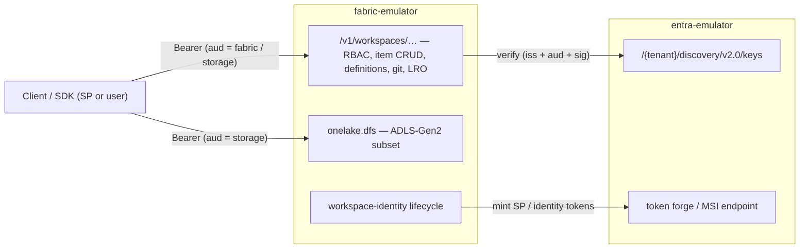

# 03 — Architecture

fabric-emulator is a **control-plane contract emulator** for Microsoft Fabric,
plus a thin OneLake data-plane surface. It is the sibling of
[entra-emulator](https://github.com/calvinchengx/entra-emulator): where that
project is an Entra ID STS, this one is the Fabric REST surface that *consumes*
Entra tokens.

## Version grounding

Fabric is evergreen SaaS: no product version exists, and
[`MicrosoftDocs/fabric-docs`](https://github.com/MicrosoftDocs/fabric-docs) has
**no tags or releases** (a continuously published `main`, ~100+ commits/week).
The only contract version Microsoft exposes is the **`/v1` path segment** of the
REST API — that is what this emulator targets.

For clean-room reproducibility we therefore pin the docs **commit**, not a
version. All claims in this doc set were verified against:

> `MicrosoftDocs/fabric-docs @ 0d63906ac29d8e8befa42b13f3d1d31c0f92081a` (2026-07-10)

When re-auditing, diff the grounding files against this SHA
(`git diff 0d63906a.. -- docs/onelake/onelake-api-parity.md
docs/cicd/git-integration/git-automation.md docs/security/workspace-identity.md
docs/security/permission-model.md`) and bump the pin.

## The two-system model

A Fabric environment is two independent products with two protocols:

1. **Entra ID** — issues tokens (service-principal client credentials for the
   Fabric audience; **workspace identities** = auto-managed app registrations +
   service principals). Emulated by **entra-emulator**.
2. **The Fabric control plane** — `https://api.fabric.microsoft.com/v1/…`:
   workspace RBAC, item CRUD, item **definitions** (the CI/CD source format),
   git integration, deployment pipelines, long-running operations, and the
   workspace-identity *lifecycle orchestration*. Plus **OneLake**
   (`https://onelake.dfs.fabric.microsoft.com`), an ADLS-Gen2-shaped data plane.
   Emulated by **fabric-emulator**.

Keeping these as two composable emulators preserves single responsibility:
**fabric-emulator validates bearer tokens against entra-emulator's JWKS, exactly
as real Fabric validates against Entra.**

## Design principle: mirror entra-emulator

fabric-emulator deliberately reuses entra-emulator's stack and idioms so the two
form a coherent pair and the testing primitives carry over:

| Concern | Choice (same as entra-emulator) |
|---|---|
| Language / HTTP | Go, stdlib `net/http`, host-routed muxes |
| Storage | `modernc.org/sqlite` (pure-Go, no CGO) |
| Surface routing | `Host`-header router (`api.` / `onelake.` / `portal.` muxes) |
| Determinism | Controllable **clock** (drives LRO completion) + **fault injection** |
| Portal | Svelte 5, `go:embed all:dist`, committed `dist` + CI drift guard |
| Docs site | Astro Starlight on GitHub Pages, pinned, `/docs` = source of truth |
| Distribution | GoReleaser: binaries, distroless Docker (GHCR), Homebrew, winget |
| Tests | Go unit/integration + real-SDK e2e matrix + Playwright mount smoke |
| License | Apache-2.0, clean-room from `fabric-docs` |

The **payoff of reuse**: entra-emulator's deterministic clock becomes Fabric's
LRO controller — a test can force any async operation to `Succeeded` instantly or
hold it `Running` to exercise polling. Real Fabric cannot do this.

## Token acceptance — the seam

Every `/v1/…` and OneLake request carries `Authorization: Bearer <jwt>`.
fabric-emulator validates:

- **Signature** against entra-emulator's JWKS (`{issuer}/discovery/v2.0/keys`),
  fetched once and cached, keyed by `kid`.
- **Issuer** equals the configured entra-emulator issuer.
- **Audience** ∈ {`https://api.fabric.microsoft.com`,
  `https://analysis.windows.net/powerbi/api`} for the control plane; the
  `Storage` audience (`https://storage.azure.com`) for OneLake.
- **Expiry / nbf** via the standard claim checks.

It then maps the token's `oid`/`appid`/`sub` to a **workspace role** for RBAC.
This mirrors entra-emulator's own `ValidateAccessToken` model; the only new work
is the audience set and the role lookup. Config: `--entra-issuer` +
`--entra-jwks-url` (or a discovery URL). It can point at a real tenant unchanged.

## Surfaces (host-routed)

| Host mux | Serves |
|---|---|
| `api.fabric.microsoft.com` | the `/v1` control plane (workspaces, items, RBAC, git, LRO, jobs, admin) |
| `onelake.dfs.fabric.microsoft.com` | ADLS-Gen2 subset (filesystem = workspace, path = item/…) |
| `portal.` (local) | the Svelte operator portal |

See [07-control-plane-api.md](07-control-plane-api.md) for the endpoint catalog and wire
shapes, and [13-roadmap.md](13-roadmap.md) for what lands in each phase.

## Data model (SQLite)

One pure-Go SQLite database holds the entire state — workspaces, items and
their verbatim definition parts, RBAC, capacities, operations, jobs, git
remotes, OneLake blobs, and the workspace-identity link — with cascading
deletes matching the control plane's semantics. The full schema, seed, and
state enums live in [06-data-model-and-seed.md](06-data-model-and-seed.md).

## Long-running operations

Nearly every mutation returns `202 Accepted` with an `x-ms-operation-id` header
(what the documented automation scripts read), a `Location:
/v1/operations/{id}`, and `Retry-After`. Clients poll `GET /v1/operations/{id}`
until `Status` leaves {`NotStarted`, `Running`}. The emulator models this as a first-
class `operation` row whose `completeAt` is a function of the **controllable
clock**:

- default: completes on the next poll (fast, deterministic for CI);
- `--lro-delay` or per-request fault: stays `Running` for N virtual seconds;
- fault injection: forces `Failed` with a Fabric-shaped error body.

## Non-goals

Capacity/SKU **billing**, real compute engines (Spark/SQL/KQL execution —
notebooks and pipelines are CRUD + job-state only, they don't *run*), Power BI
semantic-model evaluation, Purview audit, and real network/firewall enforcement.
fabric-emulator emulates the **contract**, not the runtime.

## Decoupling from entra-emulator

- Depends on entra-emulator **only over HTTP** (JWKS + issuer; a token-mint call
  for workspace identities in P2). No shared process.
- For Go integration tests, it *may* import entra-emulator's public `emulator`
  package to run both in one process with no network — an ergonomics option, not
  a coupling requirement.
- Primary local composition: a sibling [`docker-compose.yml`](../docker-compose.yml)
  brings up both, fabric pre-wired to entra's issuer/JWKS.
