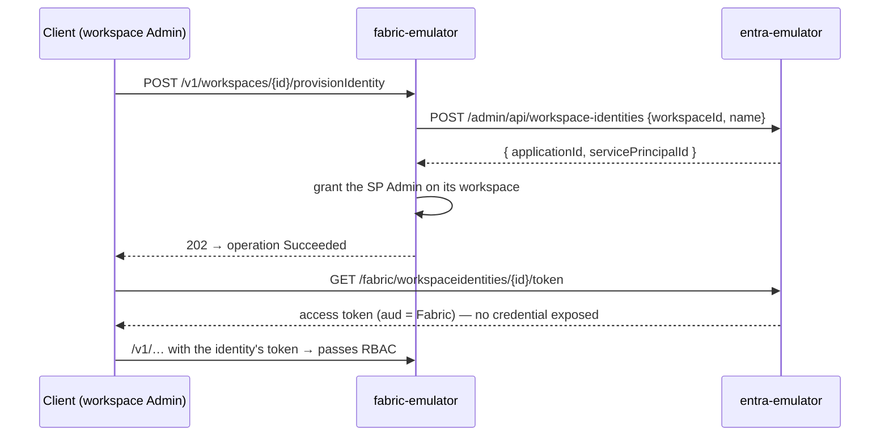

# 09 — The workspace-identity handshake

The deepest integration between the two emulators, reproducing Fabric's
**workspace identity** feature (`fabric-docs/docs/security/workspace-identity.md`):
a workspace gets its own Entra service principal, auto-managed, whose
credential no customer ever holds.

## The loop

## Control-plane surface

| Method + path | Notes |
|---|---|
| `POST /v1/workspaces/{id}/provisionIdentity` | Admin-only, 202 LRO |
| `POST /v1/workspaces/{id}/deprovisionIdentity` | Admin-only, 202 LRO |

Once provisioned, the workspace shape carries
`workspaceIdentity: { applicationId, servicePrincipalId }`.

## What each side owns

- **entra-emulator owns the identity**: the app registration + service
  principal, its state machine (`Active/Provisioning/Failed/Deprovisioning`,
  only `Active` mints), the internal token mint
  (`GET /fabric/workspaceidentities/{id}/token`), and the
  `Retrieved Fabric Identity Token for Workspace` audit event.
- **fabric-emulator owns the orchestration**: it drives entra's admin API over
  plain HTTP (`internal/entra` client; origin derived from the configured
  issuer, honoring `FABRIC_ENTRA_TLS_INSECURE`) and keeps the lifecycle
  glued to the workspace:
  - **rename follows** — renaming the workspace renames the identity;
  - **delete cascades** — deleting the workspace deprovisions the identity;
  - **RBAC grant-back** — the provisioned SP is granted **Admin on its own
    workspace**, so tokens entra mints for it are honored right back here;
    deprovisioning revokes the grant.

No shared code or process — the same HTTP calls would work against any
implementation of those endpoints.

## Why this matters for testing

The pattern under test in real life is: *a Fabric item needs to reach a
protected resource as the workspace, not as a user*. With the pair running you
can exercise the full credential-less loop offline — provision, mint, call
back into Fabric RBAC, deprovision, watch access die — deterministically and
in CI (the e2e does exactly this; see the [e2e matrix](12-e2e-matrix.md)).

Planned on top of this: `WorkspaceIdentity`-type connection credentials and
Azure Key Vault references — see the [roadmap](13-roadmap.md).
