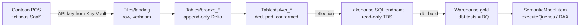

# 28 — Tutorial: end to end — Entra, Key Vault, landing, medallion, dbt gold, semantic model

A complete analytics loop against the emulator family, exactly as you would
build it on real Fabric: a fictitious SaaS source system whose API key lives in
**Key Vault**, extraction into a **landing** zone, a **bronze → silver**
medallion in lakehouse Delta, **silver → gold with dbt** into the
**Warehouse** (with data-quality tests on gold), and finally a **semantic
model** queried over the Power BI `executeQueries` wire — the readiness check
for Power BI clients. Every hop authenticates through **entra-emulator**, the
same trust relationships as production Azure.



**This tutorial is itself a test.** Every script below lives in
[`examples/medallion/`](../examples/medallion/) and runs end to end in CI via
[`e2e/medallion`](../e2e/medallion/) — the same files, unmodified, so the
instructions cannot rot silently. Read the tutorial to understand the flow; run
it yourself with:

```bash
cd examples/medallion && uv sync && uv run python run_all.py
```

or watch the containerized version with `python3 e2e/medallion/run.py`. Each
numbered snippet below is one file in that directory.

Everything here runs on `docker compose up` and is backed by a witnessed e2e
suite — this tutorial composes proven paths rather than inventing new ones:

| Hop | Mechanism | Witness |
|---|---|---|
| Tokens, every audience | entra-emulator client credentials | [15-entra-companion.md](15-entra-companion.md) |
| Secret + AKV-reference connection | azure-keyvault-emulator + workspace identity | [09-identity-handshake.md](09-identity-handshake.md), `e2e/notebookutils` |
| Landing + Delta on OneLake | Blob dialect + real delta-rs | `e2e/delta-rs`, `e2e/adls-sdk` |
| Silver → SQL | Delta→SQL reflection on the lakehouse endpoint | [16-warehouse-tds.md](16-warehouse-tds.md) |
| Gold with dbt | Microsoft's dbt-fabric over TDS + FedAuth (ODBC Driver 18) | `e2e/dbt-fabric` |
| Semantic model | TMSL definition + `executeQueries` DAX | `e2e/semantic-model`, [18-semantic-model-references.md](18-semantic-model-references.md) |
| **All of the above, in sequence** | this tutorial, executed | **`examples/medallion` via `e2e/medallion`** |

**Honesty box.** The Warehouse engine is a vanilla SQL Server sidecar, not
Fabric's MPP engine — dbt models here materialize as **views** (Fabric's
`CREATE TABLE AS SELECT` dialect is not claimed; see
[16-warehouse-tds.md](16-warehouse-tds.md) §scope). The semantic model serves
the **REST `executeQueries` contract** (what SemPy and Power BI REST clients
call), not XMLA/ADOMD — the deliberate boundary recorded in
[18-semantic-model-references.md](18-semantic-model-references.md).

## 0. Prerequisites

The family, with real compute attached (the auto-loaded override adds the
Spark engine and the SQL Server sidecar + TDS surface):

```bash
docker compose up -d
```

Ports: entra `:8443`, Key Vault `:8444`, fabric + OneLake + portal `:9443`,
warehouse TDS `:1433`. All TLS is self-signed — every snippet below disables
verification, exactly like the e2e suites.

For the dbt leg you need the **Microsoft ODBC Driver 18** (macOS:
`brew tap microsoft/mssql-release && brew install msodbcsql18`; Linux: see
`e2e/dbt-fabric/Dockerfile.dbt` for the apt recipe).

> **Apple Silicon — run your engine natively as arm64.** The only amd64-locked
> image in this stack is SQL Server (`mcr.microsoft.com/mssql/server` publishes
> no arm64 manifest); the emulators, Python, and the ODBC driver all have native
> arm64 builds, and the emulator's `Dockerfile` cross-compiles for whatever the
> host is. So a native arm64 engine — OrbStack, Docker Desktop, or
> `colima start --vm-type vz` — runs everything at full speed and lets Rosetta
> translate just the one SQL Server container.
>
> A **fully emulated x86_64 VM** (`colima start --arch x86_64` with the default
> `vmType: qemu`, `rosetta: false`) is the slow trap: QEMU interprets the whole
> kernel and userland, so every step here runs an order of magnitude slower. If
> you specifically want an x86 VM, use Apple's Virtualization.framework with
> Rosetta instead — `colima start --arch x86_64 --vm-type vz --vz-rosetta`.
>
> Engine choice is per-user, not baked into the repo: `docker compose` and the
> e2e both honour `DOCKER_CONTEXT`, so `docker context ls` then
> `DOCKER_CONTEXT=<name> …` picks one without editing anything.

Scaffold the project with uv:

```bash
mkdir fabric-tutorial && cd fabric-tutorial
uv init --bare
uv add requests pandas pyarrow deltalake pyodbc dbt-fabric
```

Each numbered step below is one file in this directory; run it as
`uv run python <file>` (uv keeps the environment pinned — no activated venv
needed).

## 1. One helper, every audience — `common.py`

Everything authenticates against entra-emulator with the seeded daemon
service principal. Non-default audiences (Storage, SQL, vault, Power BI) are
app registrations; seeding them is idempotent.

```python
# common.py — endpoints, tokens, and tutorial state.
import json, pathlib, requests, urllib3

urllib3.disable_warnings()  # the family serves self-signed TLS

TENANT = "11111111-1111-1111-1111-111111111111"
CLIENT_ID = "cccccccc-0000-0000-0000-000000000002"   # seeded daemon SP
CLIENT_SECRET = "daemon-app-secret"                  # intentionally public dev value

ENTRA = "https://localhost:8443"
KV = "https://localhost:8444"
FABRIC = "https://localhost:9443"

FABRIC_AUD = "https://api.fabric.microsoft.com"
STORAGE_AUD = "https://storage.azure.com"
SQL_AUD = "https://database.windows.net"
VAULT_AUD = "https://vault.azure.net"
PBI_AUD = "https://analysis.windows.net/powerbi/api"

S = requests.Session()
S.verify = False


def ensure_app(app_id_uri, name):
    """Register an audience in entra (409 = already there)."""
    r = S.post(f"{ENTRA}/admin/api/apps",
               json={"displayName": name, "appIdUri": app_id_uri, "isConfidential": False})
    assert r.status_code in (200, 201, 409), r.text


def token(audience):
    r = S.post(f"{ENTRA}/{TENANT}/oauth2/v2.0/token", data={
        "grant_type": "client_credentials", "client_id": CLIENT_ID,
        "client_secret": CLIENT_SECRET, "scope": audience + "/.default"})
    r.raise_for_status()
    return r.json()["access_token"]


def tds_connect(database, timeout=60):
    """FedAuth over TDS: the pre-minted Azure-SQL token rides in
    SQL_COPT_SS_ACCESS_TOKEN (1256) — the exact injection dbt-fabric performs,
    so the ODBC driver never runs MSAL. Encrypt=no because the TDS front
    terminates FedAuth without TLS (it advertises ENCRYPT_NOT_SUP)."""
    import struct

    import pyodbc

    enc = token(SQL_AUD).encode("utf-16-le")
    return pyodbc.connect(
        "DRIVER={ODBC Driver 18 for SQL Server};SERVER=localhost,1433;"
        f"Database={database};Encrypt=no;TrustServerCertificate=yes",
        attrs_before={1256: struct.pack("<i", len(enc)) + enc}, timeout=timeout)


STATE = pathlib.Path("state.json")


def save(**kv):
    state = load()
    state.update(kv)
    STATE.write_text(json.dumps(state, indent=2))


def load():
    return json.loads(STATE.read_text()) if STATE.exists() else {}
```

## 2. Provision — workspace, lakehouse, warehouse, identity

```python
# 00_provision.py
from common import *

ft = token(FABRIC_AUD)
H = {"Authorization": "Bearer " + ft}


def create(url, body):
    """Fail loudly with the emulator's error, not a KeyError three lines later.
    Display names are unique per workspace, so a second run of this script on a
    dirty stack lands here — see Cleanup at the end of the tutorial."""
    r = S.post(url, headers=H, json=body)
    assert r.status_code in (200, 201, 202), f"{url} -> {r.status_code} {r.text}"
    return r.json()


ws = create(f"{FABRIC}/v1/workspaces", {"displayName": "contoso-analytics"})
lh = create(f"{FABRIC}/v1/workspaces/{ws['id']}/lakehouses", {"displayName": "lake"})
wh = create(f"{FABRIC}/v1/workspaces/{ws['id']}/warehouses", {"displayName": "dw"})

# The workspace identity is what will fetch the Key Vault secret on Fabric's
# side when the AKV-reference connection is used (09-identity-handshake.md).
r = S.post(f"{FABRIC}/v1/workspaces/{ws['id']}/provisionIdentity", headers=H)
assert r.status_code in (200, 202), r.text

save(workspace=ws["id"], lakehouse=lh["id"], warehouse=wh["id"])
print(f"workspace={ws['id']}\nlakehouse={lh['id']}\nwarehouse={wh['id']}")
```

The seeded capacity picks the workspace up automatically — see it in the
operator portal at `https://localhost:9443` → **Capacities**.

## 3. Key Vault — the source system's API key

The fictitious SaaS ("Contoso POS") requires an API key. It lives in
azure-keyvault-emulator, never in code or config. Two consumers read it:

- **your extraction script**, with a vault-audience token — the same brokered
  read `notebookutils.credentials.getSecret` performs;
- **Fabric itself**, via an `AzureKeyVaultReference` connection resolved with
  the workspace identity.

```python
# 01_secret.py
from common import *

ensure_app(VAULT_AUD, "Azure Key Vault")
vt = token(VAULT_AUD)

# Store the key (Key Vault data plane, api-version 7.4).
r = S.put(f"{KV}/secrets/contoso-pos-api-key?api-version=7.4",
          headers={"Authorization": "Bearer " + vt},
          json={"value": "pos-key-8843-dev"})
r.raise_for_status()
print("secret stored:", r.json()["id"])

# The Fabric-side binding: an AKV-reference connection. Note the vaultUri is
# the emulator's in-network name — Fabric resolves the secret server-side, so
# the URI must be reachable from the fabric container, not from your host.
st = load()
ft = token(FABRIC_AUD)
r = S.post(f"{FABRIC}/v1/connections", headers={"Authorization": "Bearer " + ft}, json={
    "displayName": "contoso-pos",
    "connectivityType": "ShareableCloud",
    "connectionDetails": {"type": "RestApi", "path": "https://pos.contoso.example/v2/export"},
    "credentialDetails": {"credentials": {
        "credentialType": "AzureKeyVaultReference",
        "workspaceId": st["workspace"],
        "vaultUri": "https://keyvault-emulator:8444",
        "secretName": "contoso-pos-api-key"}}})
r.raise_for_status()
print("connection:", r.json()["id"])
```

Creating the connection exercises the full handshake: fabric asks entra for a
**vault-audience workspace-identity token**, presents it to Key Vault, and
fetches the secret — the probe fails honestly if any link is missing. List
`GET /v1/connections` afterwards (or open the portal's **Connections** view):
you get `credentialType: AzureKeyVaultReference` and never the secret value —
credential material is write-only, as in real Fabric.

## 4. Extract → landing

The "source system" is a small generator that refuses to export without the
API key — deliberately messy output (at-least-once duplicate order events,
inconsistent country codes, a malformed row) so silver has real work to do.
Landing keeps the export **verbatim**: raw files under `Files/landing/`,
written through OneLake's Blob dialect (the azurite-style account-prefixed
path — one `PUT` per file).

```python
# 02_extract_load.py
import datetime, io, json
from common import *

# --- the fictitious SaaS -----------------------------------------------------
CUSTOMERS_CSV = """customer_id,name,email,country
C-001,Ava Chen,ava.chen@example.com,US
C-002,Ben Okafor,Ben.Okafor@Example.com,USA
C-003,Carla Diaz,carla@example.com,us
C-004,Dev Patel,dev.patel@example.com,GB
C-005,Emi Sato,emi.sato@example.com,U.K.
C-006,Farid Rahman,,SG
C-007,Grace Lim,grace.lim@example.com,SG
C-007,Grace Lim,grace.lim@example.com,SG
"""

ORDER_EVENTS = [
    # (order_id, customer, date, qty, unit_price, status) — O-1003 is delivered
    # twice (at-least-once), the second event superseding the first; the last
    # row is malformed (negative quantity, no price).
    ("O-1001", "C-001", "2026-07-28", 2, 24.50, "shipped"),
    ("O-1002", "C-002", "2026-07-28", 1, 129.00, "shipped"),
    ("O-1003", "C-003", "2026-07-29", 3, 9.90, "pending"),
    ("O-1003", "C-003", "2026-07-29", 3, 9.90, "shipped"),
    ("O-1004", "C-004", "2026-07-30", 5, 4.20, "shipped"),
    ("O-1005", "C-005", "2026-07-30", 1, 349.00, "shipped"),
    ("O-1006", "C-007", "2026-07-31", 2, 62.00, "shipped"),
    ("O-1007", "C-006", "2026-07-31", -1, None, "error"),
]


def contoso_pos_export(api_key):
    if api_key != "pos-key-8843-dev":
        raise PermissionError("Contoso POS: invalid API key")
    orders = "\n".join(json.dumps({
        "order_id": o, "customer_id": c, "order_date": d,
        "quantity": q, "unit_price": p, "status": s, "event_seq": i})
        for i, (o, c, d, q, p, s) in enumerate(ORDER_EVENTS))
    return {"customers.csv": CUSTOMERS_CSV.encode(), "orders.jsonl": orders.encode()}


# --- fetch the key from Key Vault (as notebookutils.credentials.getSecret does)
vt = token(VAULT_AUD)
r = S.get(f"{KV}/secrets/contoso-pos-api-key?api-version=7.4",
          headers={"Authorization": "Bearer " + vt})
r.raise_for_status()
api_key = r.json()["value"]

# --- land the export verbatim ------------------------------------------------
ensure_app(STORAGE_AUD, "Azure Storage")
st_tok = token(STORAGE_AUD)
st = load()
today = datetime.date.today().isoformat()

for name, blob in contoso_pos_export(api_key).items():
    path = f"Files/landing/contoso_pos/{today}/{name}"
    r = S.put(f"{FABRIC}/onelake/{st['workspace']}/{st['lakehouse']}/{path}",
              data=blob, headers={"Authorization": "Bearer " + st_tok,
                                  "x-ms-blob-type": "BlockBlob"})
    assert r.status_code in (200, 201), (path, r.status_code, r.text)
    print("landed", path, f"({len(blob)} bytes)")
save(landing_date=today)
```

## 5. Bronze — append-only Delta

Bronze reads **from landing** (OneLake is the source of truth, not your local
disk), keeps every record — duplicates included — and stamps lineage columns.
The writer is real delta-rs (`deltalake`), producing a real `_delta_log` in
OneLake.

```python
# 03_bronze.py
import io, json, pandas as pd
from deltalake import write_deltalake
from common import *

st = load()
st_tok = token(STORAGE_AUD)

STORAGE_OPTIONS = {
    "azure_storage_account_name": "onelake",
    "azure_storage_token": st_tok,
    "azure_endpoint": f"{FABRIC}/onelake",
    "azure_allow_invalid_certificates": "true",
}


def read_landing(name):
    path = f"Files/landing/contoso_pos/{st['landing_date']}/{name}"
    r = S.get(f"{FABRIC}/onelake/{st['workspace']}/{st['lakehouse']}/{path}",
              headers={"Authorization": "Bearer " + token(STORAGE_AUD)})
    r.raise_for_status()
    return path, r.content


def stamp(df, src):
    df["_source_path"] = src
    df["_landing_date"] = st["landing_date"]
    return df


src, raw = read_landing("customers.csv")
customers = stamp(pd.read_csv(io.BytesIO(raw)), src)

src, raw = read_landing("orders.jsonl")
orders = stamp(pd.DataFrame(json.loads(l) for l in raw.decode().splitlines()), src)

base = f"az://{st['workspace']}/{st['lakehouse']}/Tables"
write_deltalake(f"{base}/bronze_customers", customers, mode="append",
                storage_options=STORAGE_OPTIONS)
write_deltalake(f"{base}/bronze_orders", orders, mode="append",
                storage_options=STORAGE_OPTIONS)
print(f"bronze: {len(customers)} customer rows, {len(orders)} order events")
```

## 6. Silver — dedupe, conform, quarantine

Silver applies the rules bronze deliberately does not: latest event wins per
`order_id`, emails lowercased, country codes conformed, malformed rows
quarantined into their own table instead of silently dropped.

```python
# 04_silver.py
import pandas as pd
from deltalake import DeltaTable, write_deltalake
from common import *

st = load()
STORAGE_OPTIONS = {
    "azure_storage_account_name": "onelake",
    "azure_storage_token": token(STORAGE_AUD),
    "azure_endpoint": f"{FABRIC}/onelake",
    "azure_allow_invalid_certificates": "true",
}
base = f"az://{st['workspace']}/{st['lakehouse']}/Tables"


def read(table):
    return DeltaTable(f"{base}/{table}", storage_options=STORAGE_OPTIONS).to_pandas()


COUNTRY = {"US": "US", "USA": "US", "GB": "GB", "U.K.": "GB", "SG": "SG"}

c = read("bronze_customers").drop_duplicates(subset=["customer_id"], keep="last").copy()
c["email"] = c["email"].str.lower()
c["country"] = c["country"].str.upper().str.strip().map(lambda v: COUNTRY.get(v, v))
silver_customers = c[["customer_id", "name", "email", "country"]]

o = read("bronze_orders").sort_values("event_seq")
o = o.drop_duplicates(subset=["order_id"], keep="last").copy()  # latest event wins
bad = (o["quantity"] <= 0) | o["unit_price"].isna()
quarantine = o[bad].copy()
o = o[~bad].copy()
o["order_date"] = pd.to_datetime(o["order_date"])
o["amount"] = o["quantity"] * o["unit_price"]
silver_orders = o[["order_id", "customer_id", "order_date", "quantity",
                   "unit_price", "amount", "status"]]

write_deltalake(f"{base}/silver_customers", silver_customers, mode="overwrite",
                storage_options=STORAGE_OPTIONS)
write_deltalake(f"{base}/silver_orders", silver_orders, mode="overwrite",
                storage_options=STORAGE_OPTIONS)
write_deltalake(f"{base}/silver_quarantine_orders", quarantine, mode="overwrite",
                storage_options=STORAGE_OPTIONS)
print(f"silver: {len(silver_customers)} customers, {len(silver_orders)} orders, "
      f"{len(quarantine)} quarantined")
```

At scale these transforms move to Spark — the same stack exposes Spark Connect
at `sc://localhost:50051` and the Livy/notebook surface
([20-lakesail-engine.md](20-lakesail-engine.md), `e2e/livy`); the Delta tables
they would write are byte-identical citizens of the same `Tables/` folder.

## 7. Checkpoint: eyeball the layers in VS Code Data Wrangler

Before trusting silver, look at it. [Data
Wrangler](https://marketplace.visualstudio.com/items?itemName=ms-toolsai.datawrangler)
gives you a profiling grid (null counts, dtypes, value distributions) over any
pandas DataFrame — ideal for verifying the medallion hops without writing
assertion code. Install the **Python**, **Jupyter**, and **Data Wrangler**
extensions, then open this cell script and run it in the Interactive Window
(`Shift+Enter` on a `# %%` cell):

```python
# 05_wrangle.py — run cells in the VS Code Interactive Window
# %%
from deltalake import DeltaTable
from common import *

st = load()
opts = {
    "azure_storage_account_name": "onelake",
    "azure_storage_token": token(STORAGE_AUD),
    "azure_endpoint": f"{FABRIC}/onelake",
    "azure_allow_invalid_certificates": "true",
}
base = f"az://{st['workspace']}/{st['lakehouse']}/Tables"

# %% bronze vs silver, side by side
bronze_orders = DeltaTable(f"{base}/bronze_orders", storage_options=opts).to_pandas()
silver_orders = DeltaTable(f"{base}/silver_orders", storage_options=opts).to_pandas()
silver_customers = DeltaTable(f"{base}/silver_customers", storage_options=opts).to_pandas()
```

In the Interactive Window's **Variables** panel, right-click
`silver_orders` → **View Value in Data Wrangler** (or click the Data Wrangler
icon next to the variable). Things worth checking against this dataset:

- `bronze_orders` has 8 rows, `silver_orders` 6 — the duplicate `O-1003`
  event collapsed to its latest state and the malformed `O-1007` went to
  quarantine, not to the floor;
- `silver_customers.country` has exactly `US`/`GB`/`SG` — the five raw
  spellings conformed;
- `amount` is a float column with no nulls, `order_date` a datetime.

Data Wrangler's operations panel (filter, drop duplicates, change type…)
**exports the pandas code for each step** — a fast way to prototype the next
silver rule interactively, then paste the generated code into `04_silver.py`.

## 8. Reflect silver into the SQL analytics endpoint

The lakehouse's SQL analytics endpoint reflects `Tables/*` Delta into the SQL
Server sidecar **on connect** ([16-warehouse-tds.md](16-warehouse-tds.md) §4).
One authenticated connection makes silver queryable T-SQL — and refreshes it
after every silver rewrite:

```python
# 06_reflect.py
import time
from common import *

st = load()
ensure_app(SQL_AUD, "Azure SQL")

# The first connect makes the emulator create and start the per-item database
# on the sidecar, which can take a while — retry until it is online.
for attempt in range(40):
    try:
        with tds_connect(st["lakehouse"], timeout=15) as c:  # connect = reflect
            rows = c.cursor().execute(
                "SELECT status, COUNT(*) AS n, SUM(amount) AS revenue "
                "FROM silver_orders GROUP BY status ORDER BY status").fetchall()
        break
    except Exception as e:
        last = e
        time.sleep(3)
else:
    raise SystemExit(f"reflection failed after retries: {last}")

for r in rows:
    print(tuple(r))
```

The endpoint is **read-only** (writes are rejected, as on real Fabric); the
Warehouse database is the read-write surface — which is where gold goes.

## 9. Gold in the Warehouse, with dbt — and DQ as dbt tests

Microsoft's real [dbt-fabric](https://github.com/microsoft/dbt-fabric) adapter
connects to the same TDS front. Sources point at the **lakehouse database**
(three-part names — both item databases live on the same sidecar), models
build in the **warehouse database**, and the data-quality bar on gold is
`dbt test`.

`profiles.yml` (the token is pre-minted, so dbt never runs MSAL):

```bash
uv run python - <<'EOF'
from common import *
st = load()
open("profiles.yml", "w").write(f"""contoso_gold:
  target: dev
  outputs:
    dev:
      type: fabric
      driver: "ODBC Driver 18 for SQL Server"
      server: "localhost,1433"
      database: "{st['warehouse']}"
      schema: "dbo"
      authentication: "ActiveDirectoryAccessToken"
      access_token: "{token(SQL_AUD)}"
      access_token_expires_on: 0
      encrypt: false
      trust_cert: true
      threads: 1
""")
open(".env-dbt", "w").write(f"export LAKEHOUSE_ID={st['lakehouse']}\n")
EOF
source .env-dbt
```

The project:

```yaml
# dbt_project.yml
name: contoso_gold
version: "1.0.0"
config-version: 2
profile: contoso_gold
model-paths: ["models"]
test-paths: ["tests"]
models:
  contoso_gold:
    # Views: standard T-SQL the sidecar runs directly. dbt-fabric's *table*
    # materialization emits Fabric's CTAS dialect, which vanilla SQL Server
    # rejects — the honest boundary from docs/16.
    +materialized: view
```

```yaml
# models/sources.yml — silver, read cross-database from the lakehouse endpoint
version: 2
sources:
  - name: silver
    database: "{{ env_var('LAKEHOUSE_ID') }}"
    schema: dbo
    tables:
      - name: silver_orders
      - name: silver_customers
```

```sql
-- models/dim_customer.sql
select customer_id, name, email, country
from {{ source('silver', 'silver_customers') }}
```

```sql
-- models/fct_orders.sql — order grain, the semantic model's fact
select order_id, customer_id, order_date, quantity, amount
from {{ source('silver', 'silver_orders') }}
```

```sql
-- models/fct_daily_revenue.sql — the reporting aggregate
select
    o.order_date,
    c.country,
    count(*)        as orders,
    sum(o.quantity) as units,
    sum(o.amount)   as revenue
from {{ ref('fct_orders') }} o
join {{ ref('dim_customer') }} c
  on o.customer_id = c.customer_id
group by o.order_date, c.country
```

The DQ contract on gold — schema tests plus business rules:

```yaml
# models/schema.yml
version: 2
models:
  - name: dim_customer
    columns:
      - name: customer_id
        tests: [unique, not_null]
      - name: country
        tests:
          - not_null
          - accepted_values:
              values: ["US", "GB", "SG"]   # silver's conformed domain
  - name: fct_orders
    columns:
      - name: order_id
        tests: [unique, not_null]   # the at-least-once duplicates must be gone
      - name: amount
        tests: [not_null]
      - name: customer_id
        tests:
          - relationships:          # every order resolves to a customer
              to: ref('dim_customer')
              field: customer_id
  - name: fct_daily_revenue
    columns:
      - name: revenue
        tests: [not_null]
```

```sql
-- tests/assert_no_negative_revenue.sql — a business rule, not a schema shape
select order_date, country, revenue
from {{ ref('fct_daily_revenue') }}
where revenue <= 0
```

### Why `accepted_values` works here — the emulator rewrites it

`accepted_values` and `relationships` are the two builtins that would *not*
run against a plain SQL Server, and understanding why explains a piece of the
emulator worth knowing about.

dbt wraps every test body so it can count failing rows, and dbt-fabric's
wrapper is a CTE:

```sql
with test_main_sql as (
  <TEST BODY>
),
dbt_internal_test as ( select * from test_main_sql )
select count(*) as failures, … from dbt_internal_test
```

`unique` and `not_null` compile to a plain `select … group by … having …`, so
they substitute cleanly. But `accepted_values` compiles to a body that *itself*
opens with a CTE:

```sql
with all_values as (
    select country as value_field, count(*) as n_records
    from dim_customer group by country
)
select * from all_values where value_field not in ('US','GB','SG')
```

Substituted, that becomes `with test_main_sql as ( with all_values as (…) … )`
— a `WITH` opening immediately inside another CTE's parentheses, a **nested
CTE**. Fabric Warehouse runs that happily; **plain SQL Server rejects it** at
parse time:

```
[Microsoft][ODBC Driver 18 for SQL Server][SQL Server]Incorrect syntax near the keyword 'with'. (156)
```

Since the emulator's engine *is* a plain SQL Server sidecar, that would make it
stricter than the real thing — so the TDS layer closes the gap itself,
flattening the nesting into the sequential form the sidecar accepts before
forwarding:

```sql
-- what dbt sends                 -- what the sidecar receives
with test_main_sql as (           with all_values as (…),
    with all_values as (…)             test_main_sql as (…),
    select …                           dbt_internal_test as (…)
), dbt_internal_test as (…)       select count(*) as failures …
select count(*) as failures …
```

The rows still come from a real engine running real T-SQL; only the statement's
dialect changes. Statements Fabric *itself* rejects are refused rather than
rewritten, so a green build here still means a green build there.

> The whole mechanism — what is rewritten, what is refused, and the T-SQL
> surface mapped in both directions — is
> [29-tsql-parity.md](29-tsql-parity.md). Note that dbt-fabric has an open bug
> of its own in this area ([microsoft/dbt-fabric#318][i318]), so these builtins
> may still fail against *real* Fabric for reasons unrelated to the engine.

[nested-cte]: https://learn.microsoft.com/en-us/sql/t-sql/queries/nested-common-table-expression?view=fabric&preserve-view=true
[i318]: https://github.com/microsoft/dbt-fabric/issues/318

Build it — models and tests in dependency order:

```bash
DBT_PROFILES_DIR=. uv run dbt build
```

```
Finished running 10 data tests, 3 view models in 0 hours 0 minutes and 20.42 seconds
Completed successfully
Done. PASS=13 WARN=0 ERROR=0 SKIP=0 NO-OP=0 REUSED=0 TOTAL=13
```

Everything passes because silver already enforced the contract: the malformed
row is in quarantine, countries are conformed, the duplicate order collapsed.

**A contract that never fails is not a contract.** Prove the gate is real by
poisoning silver — append a duplicate order with a negative amount, re-run the
reflection (`06`), and rebuild:

```bash
uv run python - <<'EOF'
import pandas as pd
from deltalake import DeltaTable, write_deltalake
from common import *
st = load()
opts = {"azure_storage_account_name": "onelake", "azure_storage_token": token(STORAGE_AUD),
        "azure_endpoint": f"{FABRIC}/onelake", "azure_allow_invalid_certificates": "true"}
url = f"az://{st['workspace']}/{st['lakehouse']}/Tables/silver_orders"
good = DeltaTable(url, storage_options=opts).to_pandas()
write_deltalake(url, pd.concat([good, good.head(1).assign(amount=-5.0)], ignore_index=True),
                mode="overwrite", storage_options=opts)
EOF
uv run python 06_reflect.py
DBT_PROFILES_DIR=. uv run dbt build
```

```
10 of 13 FAIL 1 unique_fct_orders_order_id ..................... [FAIL 1 in 0.12s]
Done. PASS=9 WARN=0 ERROR=1 SKIP=3 NO-OP=0 REUSED=0 TOTAL=13
```

`unique_fct_orders_order_id` catches the duplicate and `dbt build` stops there
— because `build` interleaves tests with models, the three downstream objects
(`fct_daily_revenue` and its two tests) are **skipped** rather than built on
data already known to be bad. That is the property you want: a broken contract
halts the graph instead of propagating into the reporting layer.

Restore silver (`uv run python 04_silver.py && uv run python 06_reflect.py`)
and the build goes green again. That loop — silver rule ↔ gold test — is the
medallion working as designed, and `e2e/medallion` asserts **both** halves of
it in CI (green on clean data, red on poisoned) so the gate can't quietly stop
gating.

## 10. Semantic model — the Power BI readiness check

The gold star becomes a **SemanticModel item**: a TMSL `model.bim` (tables,
relationship, measures) plus its rows. In real Fabric the rows arrive by
Direct Lake; the emulator seeds them as a `data.json` definition part
([18-semantic-model-references.md](18-semantic-model-references.md)) — here
exported straight from the warehouse gold you just built, closing the loop.

```python
# 07_semantic_model.py
import base64, json, time
from common import *

st = load()
ft = token(FABRIC_AUD)
H = {"Authorization": "Bearer " + ft}

# --- rows: export gold from the warehouse over TDS ---------------------------
with tds_connect(st["warehouse"]) as c:
    cur = c.cursor().execute(
        "SELECT order_date, country, orders, units, revenue FROM fct_daily_revenue")
    fact = [{"OrderDate": str(r[0])[:10], "Country": r[1], "Orders": int(r[2]),
             "Units": int(r[3]), "Revenue": float(r[4])} for r in cur.fetchall()]
    cur = c.cursor().execute("SELECT customer_id, name, country FROM dim_customer")
    dim = [{"CustomerId": r[0], "Name": r[1], "Country": r[2]} for r in cur.fetchall()]

model = {
    "name": "ContosoRevenue",
    "compatibilityLevel": 1550,
    "model": {
        "culture": "en-US",
        "tables": [
            {"name": "Customer", "columns": [
                {"name": "CustomerId", "dataType": "string", "sourceColumn": "CustomerId"},
                {"name": "Name", "dataType": "string", "sourceColumn": "Name"},
                {"name": "Country", "dataType": "string", "sourceColumn": "Country"}]},
            {"name": "Revenue", "columns": [
                {"name": "OrderDate", "dataType": "string", "sourceColumn": "OrderDate"},
                {"name": "Country", "dataType": "string", "sourceColumn": "Country"},
                {"name": "Orders", "dataType": "int64", "sourceColumn": "Orders"},
                {"name": "Units", "dataType": "int64", "sourceColumn": "Units"},
                {"name": "Revenue", "dataType": "double", "sourceColumn": "Revenue"}],
             "measures": [
                {"name": "Total Revenue", "expression": "SUM(Revenue[Revenue])"},
                {"name": "Total Units", "expression": "SUM(Revenue[Units])"},
                {"name": "Revenue per Unit",
                 "expression": "DIVIDE([Total Revenue], [Total Units])"}]}],
        "relationships": [
            {"name": "Revenue_Customer", "fromTable": "Revenue",
             "fromColumn": "Country", "toTable": "Customer", "toColumn": "Country"}]},
}
data = {"Customer": dim, "Revenue": fact}


def part(path, obj):
    return {"path": path, "payloadType": "InlineBase64",
            "payload": base64.b64encode(json.dumps(obj).encode()).decode()}


r = S.post(f"{FABRIC}/v1/workspaces/{st['workspace']}/items", headers=H, json={
    "displayName": "ContosoRevenue", "type": "SemanticModel",
    "definition": {"parts": [part("model.bim", model), part("data.json", data)]}})
assert r.status_code in (201, 202), r.text
dataset = None
if r.status_code == 201:
    dataset = r.json()["id"]
else:  # LRO: poll, then fetch the result
    op = r.headers["x-ms-operation-id"]
    while S.get(f"{FABRIC}/v1/operations/{op}", headers=H).json()["status"] not in ("Succeeded", "Failed"):
        time.sleep(1)
    dataset = S.get(f"{FABRIC}/v1/operations/{op}/result", headers=H).json()["id"]
save(dataset=dataset)

# --- query it exactly as a Power BI REST client would ------------------------
ensure_app(PBI_AUD, "Power BI Service")
pt = token(PBI_AUD)
dax = ("EVALUATE SUMMARIZECOLUMNS(Customer[Country], "
       "\"Revenue\", [Total Revenue], \"PerUnit\", [Revenue per Unit])")
r = S.post(f"{FABRIC}/v1.0/myorg/groups/{st['workspace']}/datasets/{dataset}/executeQueries",
           headers={"Authorization": "Bearer " + pt},
           json={"queries": [{"query": dax}]})
r.raise_for_status()
for row in r.json()["results"][0]["tables"][0]["rows"]:
    print(row)
```

**What "readiness for Power BI" means here, precisely.** Three surfaces are in
place, each with its production counterpart:

1. `executeQueries` with a real **Power BI-audience** token is the wire
   contract Power BI REST clients and SemPy
   (`fabric.evaluate_dax`) speak — proven against golden DAX oracles in
   `e2e/semantic-model`, and validated by Great Expectations suites in
   `e2e/great-expectations` (the SemPy + GX tutorial, re-pointed);
2. the Warehouse answers **TDS with Entra FedAuth** — the protocol a Power BI
   **DirectQuery** SQL connection uses ([16-warehouse-tds.md](16-warehouse-tds.md));
3. what is **not** claimed: XMLA/ADOMD (Power BI Desktop's native model
   connection) — the recorded boundary in
   [18-semantic-model-references.md](18-semantic-model-references.md).

## 11. Watch it in the operator portal

Open `https://localhost:9443` — the read-only operator portal shows everything
this tutorial created: the workspace and its items, the **Connections** view
(`contoso-pos` flagged as a Key Vault reference, secret never shown), the
seeded **Capacity** with the workspace assigned, the **Warehouse SQL** panel
reporting the TDS listener in relay mode, and any jobs and operations the
control-plane calls enqueued.

## Cleanup / re-run

Every script is idempotent-ish for a tutorial pass: bronze appends (a second
run doubles bronze rows — silver's dedupe absorbs it), silver and gold
overwrite, the reflection refreshes on each connect. To start truly clean:
`docker compose down -v && docker compose up -d`.

## Where to go next

- Swap the pandas silver step for Spark Connect (`sc://localhost:50051`) or a
  `RunNotebook` job on the real engine — [14-real-compute.md](14-real-compute.md).
- Catalog the whole flow into OpenMetadata:
  `docker compose --profile governance up` — [22-openmetadata.md](22-openmetadata.md).
- Point the same scripts at real Fabric — [21-real-fabric-toggle.md](21-real-fabric-toggle.md):
  the emulator's whole premise is that nothing here is emulator-specific.
